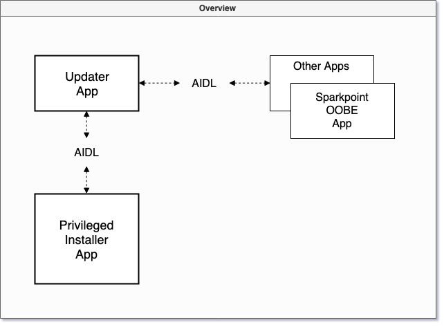

[](https://circleci.com/gh/SodaLabs/ApkUpdater)

# Overview

<p align="center">
  
</p>

There are two application modules ([apkupdater](apkupdater) and [privilegedinstaller](privilegedinstaller)) and one library module ([updaterengine](updaterengine)) in the repository.

# UpdaterEnginge Library

The updater SDK. [More details here](https://www.notion.so/sodalabs/APK-Updater-Overview-a3033e1f51604668a9dae02bdb1d7d09)

# ApkUpdater App

The updater app integrated with the engine SDK. [More details here](https://www.notion.so/sodalabs/APK-Updater-Overview-a3033e1f51604668a9dae02bdb1d7d09)


# Privileged Install App

The silent installer signed with the Android platform key. [More details here](https://www.notion.so/sodalabs/APK-Updater-Overview-a3033e1f51604668a9dae02bdb1d7d09)

# How to Build

### Bugsnag API Keys

We use Bugsnag to track the crashes. Each App has a unique Bugsnag API key and the key is stored in `bugsnag.properties`.

You'll need to download two `bugsnag.properties` files for the [apkupdater](apkupdater) and [privilegedinstaller](privilegedinstaller) respectively.

* [Download here](https://drive.google.com/open?id=1eYL1lPB0mHgXj4rttdDycjmOFPoF4vfN) for the **apkupdater**'s bugsnag file. *Place the file under `apkupdater/` folder.*

* [Download here](https://drive.google.com/open?id=18RoriHpDFS5cptAl560H59Tsb_vrJscf) for the **privilegedinstaller**'s bugsnag file. *Place the file under `privilegedinstaller/` folder.*

### Android Platform Signing Keys

All the apps here are signed with the Android platform key. For successful signing the APK, you'll need:

* Key store, [download here](https://drive.google.com/open?id=1IXPvYIFQz0cPlzw88HIJ8M_Ipf7IYSy1).
* Actual key, [download here](https://drive.google.com/open?id=1Q6UysSx2CmMPfhFOSwe87nSXvwFZeq5u).

*Place he files under project root folder.*

# On-site Support

### Toggle Logging for Production

Enable logging.

```
# 1 to enable; 0 to disable
adb shell settings put secure forcefully_loggable 1
```

Disable logging.

```
# 1 to enable; 0 to disable
adb shell settings put secure forcefully_loggable 0
```

# Code Owners

* @boyw165
* @xuhaibahmad
* @kevinmmarlow